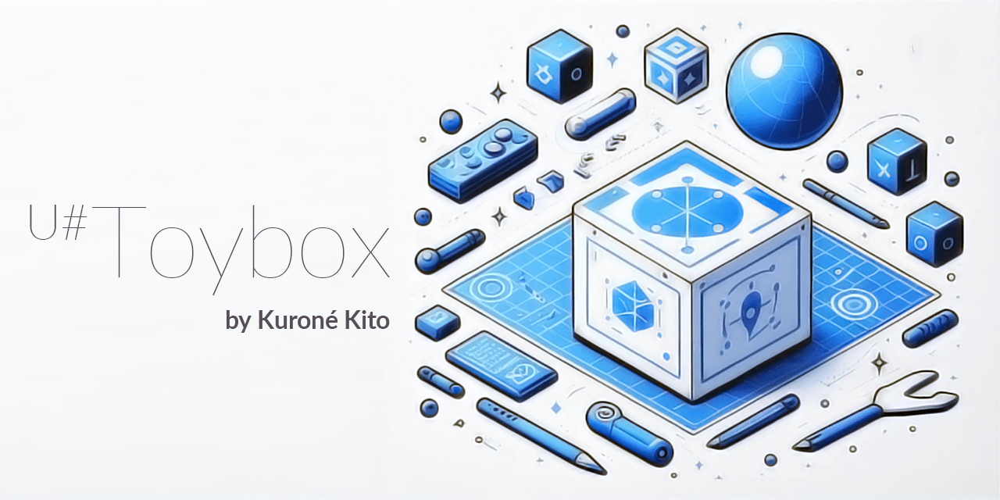

# 

My utilities library for the UdonSharp / VRChat

## 💡 Features

- 🌈 Logger with vivid colors
- ⚙️ Some extended methods for the arrays, strings, and VRCPlayerApi

## 💻 System Requirements

- [VRChat Creator Companion](https://vrchat.com/home/download)
- Unity 2022.3.6f1
- 🏝 Project of your world

## ▶ Getting Started

### 1. Import the registry via the VRChat Creator Companion (VCC)

(To be added)

### 2. Import the UdonSharp Toybox package to your project

(To be added)

### 3. Use the utilities, enjoy :D

Example:

```csharp
using black.kit.toybox;

public class Example : UdonSharpBehaviour
{
    public void Start()
    {
      // Example of using the Contains extension method
      var array = new[] { 1, 2, 3, 4, 5 };
      Debug.Log($"Contains(3): {array.Contains(3)}");
      Debug.Log($"Contains(6): {array.Contains(6)}");
    }
}
```

## License

This repository is licensed under the **MIT License**.
